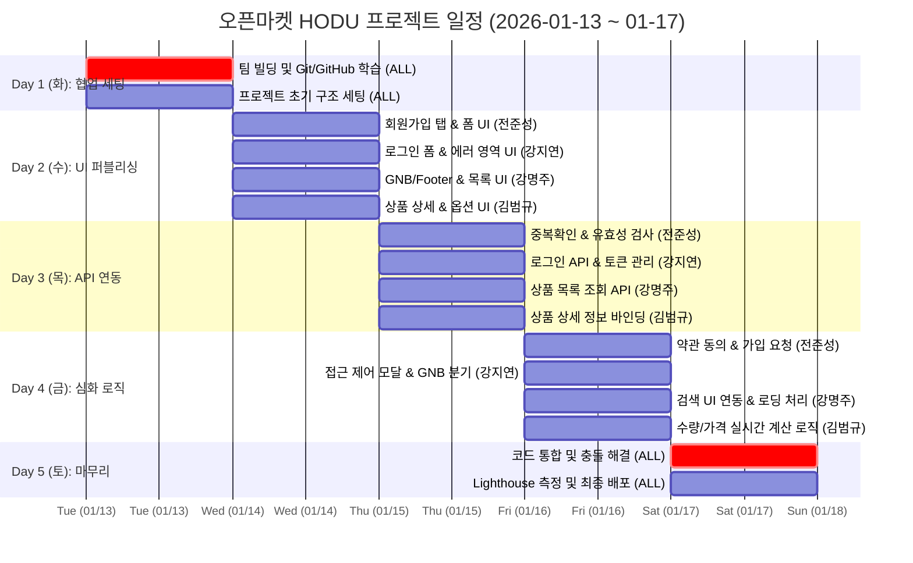

# 오픈마켓 플랫폼 HODU (호두)
> **Vanilla JS 기반의 MPA 아키텍처 및 REST API 연동 커머스 프로젝트**

<br>

## 1. 프로젝트 개요

### 1.1 서비스 소개
**"사용자 중심의 직관적인 오픈마켓 쇼핑몰, HODU"**
HODU(호두)는 사용자가 다양한 상품을 쉽고 빠르게 탐색하고, 장바구니 담기부터 결제까지 끊김 없이 이용할 수 있는 **B2C 기반의 쇼핑몰 서비스**입니다.
* **기획 의도**: 실제 운영 중인 커머스 서비스의 핵심 구매 프로세스(회원가입 → 상품 탐색 → 장바구니 → 주문)를 웹 표준 기술만으로 구현하여, **사용자 경험(UX)과 비동기 데이터 처리**를 깊이 있게 연구하고자 제작했습니다.
* **타겟 사용자**: 간편하게 물건을 구매하고자 하는 일반 소비자.

### 1.2 프로젝트 목표 (Technical Goals)
* **Vanilla JS 기반 MPA 아키텍처 설계**: 프레임워크 없이 순수 자바스크립트로 다중 페이지(MPA) 간의 유기적인 라우팅 및 데이터 전달 구조를 확립합니다.
* **REST API 기반 실시간 데이터 연동**: `fetch` API와 `async/await`를 활용하여 백엔드 서버와 비동기 통신을 구현하고, 상품 및 주문 데이터를 실시간으로 핸들링합니다.
* **사용자 중심의 인터랙티브 UX 구현**: 유효성 검사 피드백, 자동 Focus 이벤트, 실시간 가격 계산 시스템 등 세밀한 인터랙션으로 사용자 편의성을 극대화합니다.
* **Git Flow 기반 체계적 협업**: Organization 환경에서 Issue 발행 및 PR 기반의 코드 리뷰 프로세스를 준수하며 팀 프로젝트 운영 능력을 배양합니다.

### 1.3 핵심 기능 (Key Features)
* **인증 시스템**: 일반 회원가입(아이디/이메일 중복 확인), JWT 기반 로그인 및 접근 권한 제어.
* **상품 탐색**: 메인 상품 리스트 동적 렌더링, 검색 기능, URL 파라미터를 활용한 상품 상세 정보 로드.
* **주문/결제**: 실시간 수량 조절 및 총 결제 금액 계산, 장바구니 기능 및 재고 기반 구매 제한 로직.
* **공통 UI**: 로그인 상태(회원/비회원)에 따른 동적 GNB(상단바) 및 드롭다운 메뉴 시스템.
<br>

### 1.3 팀 구성
<table>
    <tr>
        <th>팀장 전준성</th>
        <th>팀원 강지연</th>
        <th>팀원 OOO</th>
        <th>팀원 김범규</th>
    </tr>
    <tr>
        <td align="center"></td>
        <td align="center">
  
</td>
        <td align="center"></td>
      <td align="center"></td>
    </tr>
    <tr>
        <td align="center"><a href="https://github.com/junsung-jeon">@junsung-jeon</a></td>
        <td align="center"><a href="https://github.com/본인아이디">@본인아이디</a></td>
        <td align="center"><a href="https://github.com/팀원아이디">@팀원아이디</a></td>
      <td align="center"><a href="https://github.com/kbgqr15">@kbgqr15</a></td>
    </tr>
</table>

<br>

## 2. 개발 환경 및 배포 URL

### 2.1 개발 환경
- **Frontend:** HTML5, CSS3, JavaScript (ES6+)
- **Version Control:** Git, GitHub
- **Deploy:** GitHub Actions, GitHub Pages
- **Editor:** VS Code
- **Collaboration:** Notion, Discord

### 2.2 배포 URL
- **Service URL:** https://second-project2.github.io/Open-Market-Service-OMS-/
- **Test Account:**
  ```text
  ID : qwer1  
  PW : qwerqwer1!
### 2.3 프로젝트 구조
GitHub Actions 배포 설정에 따라 html 폴더를 루트(root)로 하여 배포됩니다.
```
📦 Open-Market-Service-HODU
 ┣ 📂 .github
 ┃ ┗ 📂 workflows
 ┃   ┗ 📜 static.yml             # GitHub Actions 자동 배포 설정 파일
 ┣ 📂 assets
 ┃ ┣ 📂 banner                   # 메인 배너 이미지 리소스
 ┃ ┣ 📂 icons                    # 아이콘 관련 리소스 (Logo, Check 등)
 ┃ ┗ 📂 images                   # 일반 이미지 리소스
 ┣ 📂 css
 ┃ ┣ 📜 common.css               # 공통 변수(컬러, 폰트) 및 GNB 스타일
 ┃ ┣ 📜 error.css                # 에러 페이지 전용 스타일
 ┃ ┣ 📜 font.css                 # 웹 폰트 설정 파일
 ┃ ┣ 📜 header.css               # 상단 네비게이션 전용 스타일
 ┃ ┣ 📜 index.css                # 메인 상품 목록 스타일
 ┃ ┣ 📜 login.css                # 로그인 페이지 스타일
 ┃ ┣ 📜 mypage.css               # 마이페이지 관련 스타일
 ┃ ┣ 📜 product.css              # 상품 상세 페이지 스타일
 ┃ ┣ 📜 reset.css                # 브라우저 기본 스타일 초기화
 ┃ ┗ 📜 signup.css               # 회원가입 및 유효성 검사 메시지 스타일
 ┣ 📂 html
 ┃ ┣ 📜 error.html               # 404 및 에러 안내 페이지
 ┃ ┣ 📜 footer.html              # 하단 푸터 컴포넌트 (분리 관리)
 ┃ ┣ 📜 header.html              # 상단 헤더 컴포넌트 (분리 관리)
 ┃ ┣ 📜 index.html               # 메인 페이지 (서브 경로용)
 ┃ ┣ 📜 login.html               # 로그인 페이지
 ┃ ┣ 📜 mypage.html              # 마이페이지
 ┃ ┣ 📜 product.html             # 상품 상세 정보 페이지
 ┃ ┣ 📜 signup.html              # 회원가입 페이지
 ┃ ┗ 📜 test.html                # 기능 테스트용 임시 파일
 ┣ 📂 js
 ┃ ┣ 📜 common.js                # 공통 유틸리티 함수
 ┃ ┣ 📜 error.js                 # 에러 핸들링 스크립트
 ┃ ┣ 📜 header.js                # 헤더 드롭다운 및 상태 관리 로직
 ┃ ┣ 📜 index.js                 # 상품 목록 API 호출 및 렌더링 (강명주)
 ┃ ┣ 📜 login.js                 # 로그인 인증 및 Focus 로직 (강지연)
 ┃ ┣ 📜 mypage.js                # 마이페이지 정보 관리 로직
 ┃ ┣ 📜 product.js               # 상품 수량 및 가격 계산 로직 (김범규)
 ┃ ┗ 📜 signup.js                # 회원가입 유효성 및 API 연동 (전준성)
 ┣ 📜 index.html                 # 서비스 전체 메인 진입점
 ┣ 📜 README.md                  # 프로젝트 통합 문서
 ┗ 📜 test.md                    # 개발 기록용 임시 문서
```
### 3. 개발 일정 (WBS)
날짜,구분,담당자,상세 개발 내용

### 📝 상세 업무 분장표 (Daily Scrum)

| 날짜 | 구분 | 담당자 | 상세 개발 내용 |
| :---: | :---: | :---: | :--- |
| **화 (Day 1)** | **협업 세팅<br>& 학습** | **전원** | - 팀명 결정 및 GitHub Organization 생성<br>- **협업 툴 학습:** Issue 발행, Kanban 관리, PR/Merge 워크플로우 숙지<br>- **초기 세팅:** 레포지토리 생성 및 폴더 구조 확립 |
| **수 (Day 2)** | **UI 구조<br>& 퍼블리싱** | **전원** | - **전준성**: 구매자/판매자 회원가입 탭 UI, 입력 폼 레이아웃<br>- **강지연**: 로그인 폼 UI, 경고 메시지 영역 확보<br>- **강명주**: 메인 GNB/Footer 구현, 상품 카드 레이아웃<br>- **김범규**: 상품 정보/이미지 배치, 옵션 선택 UI |
| **목 (Day 3)** | **기능 구현<br>(API 연동)** | **전준성** | - 아이디 중복 확인 API 연동 및 실시간 결과 피드백<br>- 비밀번호/전화번호 유효성 검사 적용 |
| | | **강지연** | - 로그인 API 연동 및 JWT 토큰 로컬스토리지 저장<br>- **[UX]** 로그인 실패 시 ID/PW 입력창 초기화 및 **자동 focus 이동** |
| | | **강명주** | - 상품 목록 조회 API(GET) 연동 및 동적 데이터 렌더링 |
| | | **김범규** | - 상품 상세 정보 조회 API 연동 및 데이터 바인딩 |
| **금 (Day 4)** | **심화 로직<br>& 고도화** | **전준성** | - 이용약관 동의 체크박스 로직 (필수 체크 확인)<br>- 최종 회원가입 요청(POST) 및 완료 후 페이지 이동 |
| | | **강지연** | - 로그인 상태 기반 GNB 버튼 분기 및 비로그인 접근 제한 모달 |
| | | **강명주** | - 상품 검색 기능 UI 연동 및 데이터 로딩 처리 |
| | | **김범규** | - **[Logic]** 수량 변경(+/-)에 따른 총 금액 실시간 계산<br>- 재고 수량 초과 시 버튼 비활성화(disabled) 처리 |
| **토 (Day 5)** | **배포<br>& QA** | **전원** | - 각 기능 브랜치(`feat/xxx`) → `dev` 브랜치 병합 (Conflict 해결)<br>- 전체 페이지 링크 연결 및 플로우 테스트<br>- **GitHub Pages 배포 및 Lighthouse 성능 측정/최적화** |

###  4. 역할 분담 (R&R)

| 이름 | 역할 | 담당 파트 및 상세 업무 |
| :---: | :---: | :--- |
| **전준성** | **Team Leader / FE** | **총괄 및 회원가입 시스템**<br>- 프로젝트 기획 및 Git Flow (PR, Conflict) 총괄 관리<br>- 실시간 아이디 중복 확인 및 유효성 검사 로직 구축<br>- 약관 동의 검증 및 회원가입 API 연동 |
| **강지연** | **FE** | **로그인 및 권한 관리**<br>- UI/UX 디자인 가이드 제작 (피그마 대응)<br>- JWT 토큰 기반 로그인 및 사용자 인증 상태 관리<br>- 로그인 실패 시 자동 Focus 등 UX 고도화 |
| **강명주** | **FE** | **메인 목록 및 GNB 시스템**<br>- 상품 목록 API 연동 및 그리드 레이아웃 구현<br>- 공통 GNB(상단바) 드롭다운 및 로그아웃 기능<br>- API 데이터 파싱 및 에러 핸들링 지원 |
| **김범규** | **FE** | **상품 상세 및 주문 로직**<br>- 상품 상세 정보 렌더링 및 동적 데이터 바인딩<br>- **실시간 총 결제 금액 계산 시스템** 구축<br>- 재고 수량 연동 및 구매 제한 로직 구현 |

<br>

## 5. 기술적 고도화 및 트러블 슈팅

### 6.1 [협업] Git Merge Conflict 해결 프로세스 정립
- **상황:** 4명의 팀원이 `dev` 브랜치로 코드를 병합하는 과정에서 `common.css`와 `index.html` 등 공통 파일에서 3회의 충돌(Conflict)이 발생했습니다.
- **원인:** 초기 세팅 단계에서 공통 스타일(Reset CSS)을 각자 수정하거나, 스크립트 태그를 동시에 추가하면서 라인이 겹치는 현상이 주원인이었습니다.
- **해결 과정:**
  1. **도구 활용:** VS Code의 **Merge Editor** 기능을 이용하여 'Current Change(내 코드)'와 'Incoming Change(팀원 코드)'를 시각적으로 비교했습니다.
  2. **소통:** 충돌 발생 시 임의로 수정하지 않고, 해당 코드를 작성한 팀원과 zep 화면 공유를 통해 "어떤 코드를 남길지(Accept Current/Incoming/Both)" 실시간으로 논의했습니다.
  3. **규칙 수립:** 이후 공통 파일 수정 시에는 반드시 단톡방에 선공지하는 규칙을 만들어 불필요한 충돌을 예방했습니다.
  4. 
### 5.2 [성능] Lighthouse 점수 48점 → 70점대 개선
- **문제 상황:** 메인 페이지 로딩 시 LCP(Largest Contentful Paint) 지표가 **181s**로 측정되며 성능 점수가 48점(Red)으로 저조하게 나왔습니다.
- **원인 분석:** 고해상도 메인 배너 이미지(PNG)의 용량이 너무 커서 리소스를 다운로드하는 데 시간이 오래 걸리는 것이 주원인이었습니다.
- **해결 과정:**
  1. 이미지 포맷을 압축률이 높은 **WebP**로 변환하고 용량을 최적화했습니다.
  2. 렌더링 차단 리소스를 줄이기 위해 불필요한 스크립트 로딩 순서를 조정했습니다.
- **성과:** 최적화 후 성능 점수 **70점(Yellow)** 달성 및 페이지 로딩 속도를 획기적으로 단축했습니다.

### 5.3 [로직] 비동기 통신 에러 핸들링 (Async/Await)
- **고민:** `fetch`를 통한 회원가입 중복 확인 시, 서버 오류(500)나 네트워크 문제 발생 시 사용자가 영문을 모른 채 대기하는 상황을 방지해야 했습니다.
- **해결:** `async/await` 구문을 `try-catch` 블록으로 감싸 네트워크 에러를 포착하고, 에러 발생 시 `alert`이나 텍스트로 **"잠시 후 다시 시도해주세요"**라는 명확한 피드백을 제공하여 사용자 경험(UX)을 보호했습니다.

### 5.4 [데이터] 상품 상세 API 데이터 구조 불일치 문제 (김범규)
- **상황:** API 문서에서는 상품 가격이 `price`로 내려온다고 되어 있었지만, 실제 응답에서는 `selling_price`로 내려와 가격이 표시되지 않는 문제가 발생했습니다.
- **원인:** 문서 기준으로 렌더링 로직을 작성하여 실제 응답 구조와 매핑이 맞지 않았습니다.
- **해결 과정:**
  1. `console.log`로 실제 응답 구조를 확인했습니다.
  2. 렌더링 로직을 `data.selling_price` 기준으로 수정했습니다.
  3. 값이 없을 경우를 대비한 예외 처리도 함께 추가했습니다.
- **성과:** 가격 정보가 정상 렌더링되고, 구조 변경에도 대응 가능한 안정성이 확보되었습니다.

### 5.5 [로직] 상품 수량 초과 입력 예외 처리 (김범규)
- **상황:** 재고 초과 시 `+` 버튼은 비활성화되었지만, 키보드 입력/직접 값 수정으로 수량이 재고를 초과할 수 있는 문제가 발생했습니다.
- **원인:** 버튼 클릭 이벤트만 검증하고, `input` 값 변경(`change`/`input`) 이벤트에는 검증 로직이 없었습니다.
- **해결 과정:**
  1. `input` 이벤트에도 재고 검증 로직을 추가했습니다.
  2. 수량이 재고보다 크면 자동으로 최대 재고 값으로 되돌리도록 처리했습니다.
  3. 버튼/직접 입력 모두 동일한 검증 로직을 타도록 통합했습니다.
- **성과:** 어떤 방식으로 값을 변경해도 재고 초과가 불가능해져 구매 로직의 일관성이 확보되었습니다.


### 6. 개발하며 느낀점
**전준성 (Team Leader)**
> **"프레임워크 없는 순수 개발의 즐거움과 협업의 무게"**
> 첫 프로젝트를 경험하면서 제가 느꼈던 가장 큰 수확은 두 가지입니다. 첫째, Vanilla JS만 이용해 MPA이지만 매끄러운 사용자 경험(Focus 이동, 실시간 유효성 검사)을 구현하며 DOM 조작과 비동기 처리에 대한 이해를 하였습니다. 또한 팀장으로서 초기 Git Flow 세팅부터 코드 병합(Merge)까지 도맡으며 Conflict를 두려워하지 않게 되었습니다. 무엇보다 팀원들의 코드가 하나로 합쳐져 유기적으로 동작하는 모습을 보며, 혼자 하는 코딩보다 함께하는 개발의 가치를 깨달았습니다.

**김범규  (Team merber)**
> **"프레임워크 없는 순수 개발의 즐거움과 협업의 무게"**
> "사용자의 한 번의 클릭이 화면 전체를 바꾼다" 상품 상세 페이지를 구현하며, 한 번의 클릭이 단순한 숫자 변화가 아니라 화면 전체의 흐름을 바꾼다는 것을 느꼈습니다. 수량 버튼 하나에도 가격, 재고, 버튼 상태가 함께 반응해야 했고, 이 연결 구조를 설계하는 과정에서 로직의 중요성을 체감했습니다. 특히 기준값에서 다시 계산하는 방식으로 로직을 바꾸면서, 기능은 ‘돌아가기만 하면 되는 것’이 아니라 ‘언제나 같은 결과를 내야 하는 것’이라는 개발의 기본을 다시 생각하게 되었습니다. 또한 팀원들의 코드와 내 코드가 만나며 생기는 작은 충돌들을 함께 해결하는 과정에서, 개발은 혼자 완성하는 작업이 아니라 서로의 생각을 맞춰가는 과정이라는 걸 분명하게 느끼게 되었습니다

[팀원 이름]

(팀원의 소감을 여기에 작성하거나 생략 가능)
