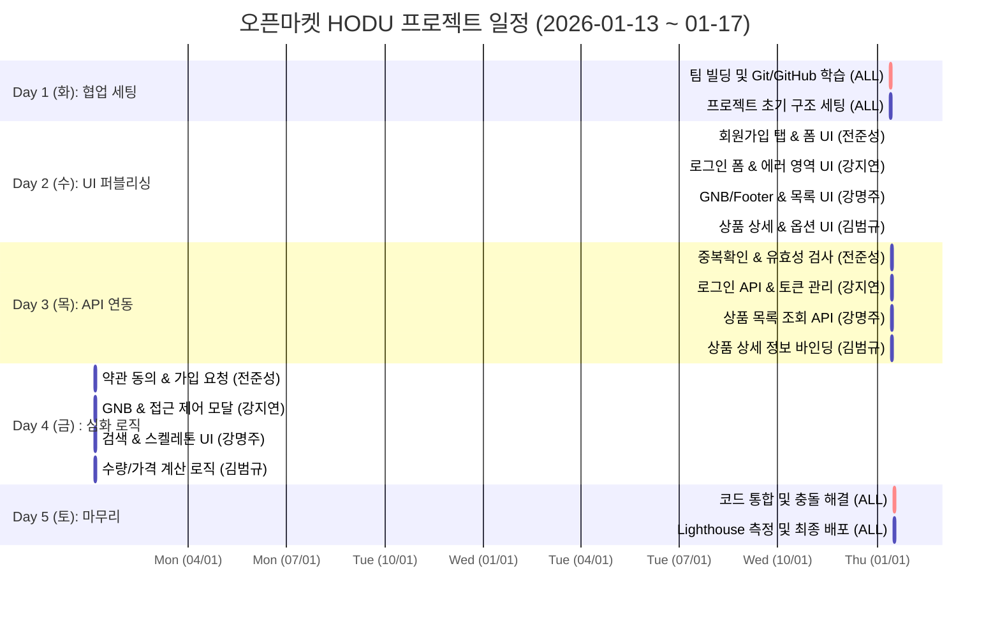

# 오픈마켓 플랫폼 HODU (호두)
> **Vanilla JS 기반의 MPA 아키텍처 및 REST API 연동 커머스 프로젝트**

<br>

## 1. 프로젝트 개요

### 1.1 프로젝트 목표
* **Vanilla JS 기반 MPA 아키텍처 설계**: 프레임워크 없이 순수 자바스크립트로 다중 페이지(MPA) 간의 유기적인 라우팅 및 데이터 전달 구조를 확립합니다.
* **REST API 기반 실시간 데이터 연동**: `fetch` API와 `async/await`를 활용하여 백엔드 서버와 비동기 통신을 구현하고, 실제 커머스 데이터를 실시간으로 핸들링합니다.
* **사용자 중심의 인터랙티브 UX 구현**: 유효성 검사 피드백, 자동 Focus 이벤트, 실시간 가격 계산 시스템 등 세밀한 인터랙션으로 사용자 편의성을 극대화합니다.
* **Git Flow 기반 체계적 협업**: Organization 환경에서 Issue 발행 및 PR 기반의 코드 리뷰 프로세스를 준수하며 팀 프로젝트 운영 능력을 배양합니다.

### 1.2 핵심 기능
* **인증 시스템**: 구매자/판매자 회원가입(실시간 중복 확인), JWT 기반 로그인 및 접근 권한 제어.
* **상품 관리**: 메인 상품 리스트 동적 렌더링, URL 파라미터를 활용한 상품 상세 정보 로드.
* **주문 로직**: 실시간 수량 조절 및 결제 금액 계산 시스템, 재고 기반 버튼 활성화 제어.
* **공통 UI**: 로그인 상태에 따른 동적 GNB(상단바) 및 드롭다운 메뉴 시스템.

<br>

### 1.3 팀 구성
<table>
    <tr>
        <th>팀장 전준성</th>
        <th>팀원 강지연</th>
        <th>팀원 OOO</th>
        <th>팀원 OOO</th>
    </tr>
    <tr>
        <td align="center"></td>
        <td align="center">
  
</td>
        <td align="center"></td>
      <td align="center"></td>
    </tr>
    <tr>
        <td align="center"><b>총괄 / 메인 페이지</b></td>
        <td align="center"><b>로그인/error페이지</b></td>
        <td align="center"><b>상품 상세 / 장바구니</b></td>
      <td align="center"><b>상품 상세 / 장바구니</b></td>
    </tr>
    <tr>
        <td align="center"><a href="https://github.com/팀장아이디">@팀장아이디</a></td>
        <td align="center"><a href="https://github.com/본인아이디">@본인아이디</a></td>
        <td align="center"><a href="https://github.com/팀원아이디">@팀원아이디</a></td>
      <td align="center"><a href="https://github.com/팀원아이디">@팀원아이디</a></td>
    </tr>
</table>

<br>

## 2. 개발 환경 및 배포 URL

### 2.1 개발 환경
- **Frontend:** HTML5, CSS3, JavaScript (ES6+)
- **Version Control:** Git, GitHub
- **Deploy:** GitHub Actions, GitHub Pages
- **Editor:** VS Code
- **Collaboration:** Notion, Discord

### 2.2 배포 URL
- **Service URL:** https://second-project2.github.io/Open-Market-Service-OMS-/
- **Test Account:**
  ```text
  ID : qwer1  
  PW : qwerqwer1!
### 2.3 프로젝트 구조
GitHub Actions 배포 설정에 따라 html 폴더를 루트(root)로 하여 배포됩니다.
```
📦 Open-Market-Service-HODU
 ┣ 📂 .github
 ┃ ┗ 📂 workflows
 ┃   ┗ 📜 static.yml             # GitHub Actions 자동 배포 설정 파일
 ┣ 📂 assets
 ┃ ┣ 📂 banner                   # 메인 배너 이미지 리소스
 ┃ ┣ 📂 icons                    # 아이콘 관련 리소스 (Logo, Check 등)
 ┃ ┗ 📂 images                   # 일반 이미지 리소스
 ┣ 📂 css
 ┃ ┣ 📜 common.css               # 공통 변수(컬러, 폰트) 및 GNB 스타일
 ┃ ┣ 📜 error.css                # 에러 페이지 전용 스타일
 ┃ ┣ 📜 font.css                 # 웹 폰트 설정 파일
 ┃ ┣ 📜 header.css               # 상단 네비게이션 전용 스타일
 ┃ ┣ 📜 index.css                # 메인 상품 목록 스타일
 ┃ ┣ 📜 login.css                # 로그인 페이지 스타일
 ┃ ┣ 📜 mypage.css               # 마이페이지 관련 스타일
 ┃ ┣ 📜 product.css              # 상품 상세 페이지 스타일
 ┃ ┣ 📜 reset.css                # 브라우저 기본 스타일 초기화
 ┃ ┗ 📜 signup.css               # 회원가입 및 유효성 검사 메시지 스타일
 ┣ 📂 html
 ┃ ┣ 📜 error.html               # 404 및 에러 안내 페이지
 ┃ ┣ 📜 footer.html              # 하단 푸터 컴포넌트 (분리 관리)
 ┃ ┣ 📜 header.html              # 상단 헤더 컴포넌트 (분리 관리)
 ┃ ┣ 📜 index.html               # 메인 페이지 (서브 경로용)
 ┃ ┣ 📜 login.html               # 로그인 페이지
 ┃ ┣ 📜 mypage.html              # 마이페이지
 ┃ ┣ 📜 product.html             # 상품 상세 정보 페이지
 ┃ ┣ 📜 signup.html              # 회원가입 페이지
 ┃ ┗ 📜 test.html                # 기능 테스트용 임시 파일
 ┣ 📂 js
 ┃ ┣ 📜 common.js                # 공통 유틸리티 함수
 ┃ ┣ 📜 error.js                 # 에러 핸들링 스크립트
 ┃ ┣ 📜 header.js                # 헤더 드롭다운 및 상태 관리 로직
 ┃ ┣ 📜 index.js                 # 상품 목록 API 호출 및 렌더링 (강명주)
 ┃ ┣ 📜 login.js                 # 로그인 인증 및 Focus 로직 (강지연)
 ┃ ┣ 📜 mypage.js                # 마이페이지 정보 관리 로직
 ┃ ┣ 📜 product.js               # 상품 수량 및 가격 계산 로직 (김범규)
 ┃ ┗ 📜 signup.js                # 회원가입 유효성 및 API 연동 (전준성)
 ┣ 📜 index.html                 # 서비스 전체 메인 진입점
 ┣ 📜 README.md                  # 프로젝트 통합 문서
 ┗ 📜 test.md                    # 개발 기록용 임시 문서
```
### 3. 개발 일정 (WBS)
날짜,구분,담당자,상세 개발 내용
### 📝 상세 업무 분장표 (Daily Scrum)

### 📝 상세 업무 분장표 (Daily Scrum)

| 날짜 | 구분 | 담당자 | 상세 개발 내용 |
| :---: | :---: | :---: | :--- |
| **화 (Day 1)** | **협업 세팅<br>& 학습** | **ALL** | - 팀명 결정 및 GitHub Organization 생성<br>- Git Flow 학습 (Issue 발행, Kanban 관리, PR, Merge)<br>- 초기 세팅: 레포지토리 생성 및 폴더 구조 확립 |
| **수 (Day 2)** | **UI 구조<br>& 퍼블리싱** | **전원** | - **전준성**: 회원가입 탭 UI, 입력 폼 레이아웃<br>- **강지연**: 로그인 폼 UI, 입력값 검증 및 오류 메시지 출력<br>- **강명주**: 목록(Index) GNB/Footer, 카드 레이아웃<br>- **김범규**: 상세(Product) 정보 배치, 옵션 UI |
| **목 (Day 3)** | **기능 구현<br>(API 연동)** | **전준성** | - 아이디 중복 확인 API 연동 (실시간 피드백)<br>- 비밀번호/전화번호 정규식 유효성 검사 적용 |
|  |  | **강지연** | - 로그인 API 연동 및 JWT 인증 처리<br>- 로그인 실패 시 에러 처리 및 UX 개선 (focus 이동)<br>- 에러 페이지 구현 및 버튼 클릭 시 페이지 이동 로직 구현 |
|  |  | **강명주** | - 상품 목록 조회 API (GET) 연동<br>- 서버 데이터 기반 상품 카드 동적 렌더링 |
|  |  | **김범규** | - 상품 상세 정보 조회 API 연동<br>- 상품 이미지, 판매자명, 가격 데이터 바인딩 |
| **금 (Day 4)** | **심화 로직<br>& 고도화** | **전준성** | - 이용약관 동의 체크박스 로직 (필수 체크 확인)<br>- 최종 회원가입 요청(POST) 및 완료 후 페이지 이동 |
|  |  | **강지연** | - 로그인 페이지 기능 점검<br>- 프로젝트 정리 |
|  |  | **강명주** | - 상품 검색 기능 UI 연동<br>- 데이터 로딩 중 스켈레톤 UI 또는 로딩 처리 |
|  |  | **김범규** | - [Logic] 수량 변경 (+/-)에 따른 총 금액 실시간 계산<br>- 재고 수량 초과 시 버튼 비활성화(disabled) 처리 |
| **토 (Day 5)** | **배포<br>& QA** | **ALL** | - 각 브랜치(feat/xxx) → dev 브랜치 병합 (Conflict 해결)<br>- 전체 페이지 링크 연결 및 플로우 테스트<br>- GitHub Pages 배포 및 최종 리드미 작성 |



###  4. 역할 분담 (R&R)

| 이름 | 역할 | 담당 파트 및 상세 업무 |
| :---: | :---: | :--- |
| **전준성** | **Team Leader / FE** | **총괄 및 회원가입 시스템**<br>- 프로젝트 기획 및 Git Flow (PR, Conflict) 총괄 관리<br>- 실시간 아이디 중복 확인 및 유효성 검사 로직 구축<br>- 약관 동의 검증 및 회원가입 API 연동 |
| **강지연** | **FE** | **로그인 및 권한 관리**<br>- UI/UX 디자인 가이드 제작 (피그마 대응)<br>- JWT 토큰 기반 로그인 및 사용자 인증 상태 관리<br>- 로그인 실패 시 자동 Focus 등 UX 고도화 |
| **강명주** | **FE** | **메인 목록 및 GNB 시스템**<br>- 상품 목록 API 연동 및 그리드 레이아웃 구현<br>- 공통 GNB(상단바) 드롭다운 및 로그아웃 기능<br>- API 데이터 파싱 및 에러 핸들링 지원 |
| **김범규** | **FE** | **상품 상세 및 주문 로직**<br>- 상품 상세 정보 렌더링 및 동적 데이터 바인딩<br>- **실시간 총 결제 금액 계산 시스템** 구축<br>- 재고 수량 연동 및 구매 제한 로직 구현 |

<br>

### 5. 트러블 슈팅 (Troubleshooting)
5.1 Git Merge Conflict 해결
문제 상황: dev 브랜치에 각 팀원의 기능(feat/signup, feat/login)을 병합하는 과정에서 common.css 및 index.html의 링크 연결 부분에서 충돌(Conflict)이 발생했습니다.

해결 과정:

VS Code의 Merge Editor 기능을 활용하여 충돌 지점을 시각적으로 확인했습니다.

팀원들과 상의하여 중복된 CSS Reset 코드를 정리하고, 필요한 링크 태그만 남기는 방식(Accept Both 후 수동 수정)으로 병합을 완료했습니다.

이후 git pull origin dev를 통해 로컬 브랜치를 최신 상태로 유지하는 규칙을 정립했습니다.

5.2 비동기 통신 에러 핸들링 (Async/Await)
문제 상황: 아이디 중복 확인 시, 서버에서 404 또는 400 에러를 반환할 때 스크립트가 멈추거나 사용자에게 아무런 피드백이 없는 문제가 있었습니다.

해결 과정:

try-catch 구문을 도입하여 네트워크 에러를 포착했습니다.

API가 반환하는 에러 메시지(json.message 또는 json.error)를 파싱하여, alert 창이나 입력 필드 하단의 텍스트로 사용자에게 구체적인 실패 원인을 안내하도록 로직을 개선했습니다.

5.3 배포 경로 문제 (GitHub Actions)
문제 상황: GitHub Actions로 배포 후, CSS와 JS 파일이 404 Not Found로 뜨는 현상이 발생했습니다.

해결 과정: 프로젝트 구조상 소스 코드가 html 폴더 내부에 위치해 있었으나, 배포 설정은 루트를 바라보고 있었습니다. Workflow 파일(.yml)에서 업로드 경로를 path: 'html'로 수정하여 정상적으로 리소스를 불러오도록 수정했습니다.

### 6. 개발하며 느낀점
[본인 이름]

처음에는 API 문서를 보고 막 막막했지만, 하나씩 console.log를 찍어가며 서버와 통신에 성공했을 때의 짜릿함을 잊을 수 없습니다. 특히 회원가입 폼에서 사용자의 입력에 따라 실시간으로 피드백(초록불/빨간불)을 주는 기능을 구현하면서 프론트엔드 개발의 재미를 느꼈습니다. Git 충돌을 해결하며 협업의 중요성도 깊이 배울 수 있었습니다.

[강지연]
개인 작업에서만 사용하던 GitHub를 이번 프로젝트에서 팀 협업에 직접 사용해 보면서, 배운 내용을 실제 프로젝트에 적용해 하나의 결과물을 완성할 수 있었던 점에  많은걸 배운 느낌이고 뿌듯함을 느꼈습니다

[팀원 이름]

(팀원의 소감을 여기에 작성하거나 생략 가능)
